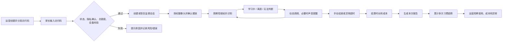

# AI 学习监督助手：项目全景基线

> 基线版本：1.1
> 基线日期：2026-07-27
> 代码基准：`07f7d42`
> 实施状态：v0.7 工作区已完成，待执行数据库迁移并部署
> 适用范围：产品、业务、设计、研发、测试、运营沟通

## 1. 一句话说明

这是一个面向中国家庭的小学生学习过程监督 MVP：家长通过访问码在手机浏览器开启摄像头，系统周期性判断孩子是否在位、是否有明确学习行为，必要时播放提醒，结束后生成本次报告和多次学习习惯趋势。

它的核心价值不是评价孩子，而是记录学习节奏、减少家长持续盯守，并帮助家庭观察连续学习时间是否逐步改善。

## 2. 事实、判断和未知

### 已由代码确认

- 产品采用 Next.js Web 应用，面向手机浏览器使用。
- 使用访问码而非用户账号进入；访问码具备套餐、总时长、状态和设备绑定。
- 浏览器通过摄像头取帧，服务端可调用 Qwen 视觉模型，也可使用 Mock 结果。
- 当前识别结果被收敛为三类业务表达：学习中、离座、无法判断。
- 系统支持自适应识别频率、语音/蜂鸣提醒、手动纠错、心跳、异常退出结算、报告和后台运营。
- Supabase 保存访问码、会话、识别记录、AI 调用、错误、风险和后台操作日志。
- 所有套餐暂时统一交付基于真实监督记录计算的基础报告，不再生成 Mock 高级趋势；DeepSeek 尚未实际接入。
- 仓库已有依赖锁文件、权益规则单元测试和持续构建检查。

### 基于产品形态的判断

- 项目处于“功能较完整的 MVP / 真实试用前后”阶段，已经能够跑完整体验闭环，但还未具备规模化商业运营所需的账户、订单、支付、客户服务和正式指标体系。
- 当前更适合验证三个问题：摄像头部署是否可用、状态识别是否可信、提醒与报告是否真的帮助家长。
- 访问码大概率由运营人员手工创建和分发；仓库中没有自动销售和交付流程。

### 当前未知

- 是否已有正式线上环境、实际用户、付费客户和稳定流量。
- 访问码从何处售卖、实际售价、退款率、获客渠道和客服流程。
- 真实识别准确率、设备兼容率、监督完成率、留存和续费。
- 线上数据库是否已执行全部迁移，当前启用 Mock 还是 Qwen。
- 隐私政策、监护人授权、第三方模型数据处理约定是否已在线下完成。

以上未知项只能通过线上配置、运营信息和真实数据补充，不能从代码推断为事实。

## 3. 用户与角色

| 角色 | 核心诉求 | 当前入口 | 当前能力 |
| --- | --- | --- | --- |
| 家长/监护人 | 少盯守、了解学习过程、获得可行动建议 | `/`、`/report` | 输入访问码、查看历史报告、打印报告 |
| 学习中的孩子 | 在不过度打扰的情况下获得及时提醒 | `/supervise` | 摄像头监督、声音提醒、手动纠错 |
| 运营/管理员 | 发放权益、处理退款/设备/额度、排查问题 | `/admin` | 访问码、会话、日志、成本、模型和操作管理 |
| 系统维护者 | 控制质量、成本、安全和稳定性 | 代码、Supabase、Vercel | 模型配置、定时结算、日志排查 |

当前没有账户体系，因此一个访问码基本承担了“客户身份 + 套餐权益 + 设备许可”的职责，也没有多孩子、多监护人或跨设备同步模型。

## 4. 核心用户闭环

### 正常路径

1. 管理员选择套餐并创建访问码。
2. 家长在首页输入访问码；首次使用时绑定浏览器生成的设备 ID。
3. 后端校验访问码状态、隐私确认、总剩余额度和设备，创建会话与会话令牌；会话创建后开始计时。
4. 监督页请求摄像头权限，用户确认摆放和声音可用。
5. 前端按套餐下限和学习时长动态安排识别：
   - 学习开始 15 分钟内期望 15 秒一次；
   - 15–60 分钟期望 30 秒一次；
   - 60–120 分钟期望 60 秒一次；
   - 120 分钟后期望 90 秒一次；
   - 最终频率不得高于套餐允许的最小间隔。
6. 状态异常时提高观察频率；稳定学习时适当降低频率。
7. 离座或无法判断达到条件后播放本地语音/蜂鸣，提醒冷却会随近期状态动态调整。
8. 用户可对最新识别结果手动标记。
9. 结束后服务端按数据库时间和真实记录结算，在数据库事务内结束会话并原子扣减访问码时长，生成报告访问令牌。
10. 报告可刷新、打印或保存为 PDF；首页本地保存最近报告入口。

### 异常恢复

- 活跃会话 60 秒发送一次心跳。
- 180 秒没有心跳视为超时，可在再次验证访问码或定时任务中自动结算。
- 未超时的活跃会话会提示继续或结束，避免重复创建。
- Vercel 按 Cron 表达式 `0 3 * * *` 调用清理接口；业务请求也会触发同一访问码的超时结算。具体执行时区应以部署平台配置为准。

## 5. 产品范围

### 已实现

- 访问码验证、隐私确认、设备绑定、永久有效总额度和生命周期状态。
- 摄像头前后置切换、权限诊断、摆放确认和声音测试。
- Mock / Qwen 视觉识别及失败后回退 Mock。
- 学习中、离座、无法判断的状态展示。
- 动态识别频率、离座/无法判断提醒、提醒冷却。
- 识别记录手动纠错。
- 会话心跳、恢复、手动结束和超时结算。
- 基于真实记录的基础学习报告、数据覆盖率/可信度、关键节点、家长建议和多次习惯趋势。
- 访问码运营、会话明细、错误/风险、成本、模型配置和后台操作审计。

### 部分实现或测试态

- Qwen 已有真实调用路径，但是否可用取决于线上密钥和模型配置。
- 所有套餐当前都使用规则模板生成真实基础报告；代码不再返回 `mock-deepseek` 模拟内容。
- 习惯趋势使用最近最多 7 次有效会话计算，至少 3 次才形成方向判断。
- 截图存储只有本地占位实现，当前识别接口直接接收前端图片数据，仓库中没有正式对象存储和删除任务。

### 当前不在产品内

- 注册、登录、用户/家庭/孩子档案。
- 订单、支付、优惠、自动发码、发票和退款支付链路。
- 多孩子、多监护人、跨设备使用。
- 周报/月报推送、微信通知、小程序或原生 App。
- 人脸识别、身份识别、视频保存。
- 正式客服工单、用户反馈闭环和实验平台。

## 6. 套餐与权益基线

当前套餐只以总监督时长控制，所有权益永久有效。数据库中的 `daily_minutes`、`used_today_minutes` 和 `last_reset_date` 是兼容旧库的历史字段，不再形成每日限制。

| 内部类型 | 展示名称 | 总时长 | 识别基础间隔 | 最小间隔 | 报告等级 |
| --- | --- | ---: | ---: | ---: | --- |
| `trial` | 2 小时体验版 | 120 分钟 | 90 秒 | 60 秒 | 基础 |
| `basic_monthly` | 月卡 | 3,600 分钟 | 90 秒 | 60 秒 | 基础 |
| `standard_monthly` | 季卡（180 小时，永久有效） | 10,800 分钟 | 60 秒 | 30 秒 | 基础 |
| `pro_monthly` | 年卡（720 小时，永久有效） | 43,200 分钟 | 30 秒 | 15 秒 | 基础 |

重要现状：

- 创建和迁移后的访问码不设置日期有效期；不使用时不扣时，只有总分钟耗尽后停止访问。
- 后台“改套餐”会同步套餐默认总时长和识别频率：选择重置时按新套餐总时长重新计算；不重置时保留已用分钟，并确保新总额度不小于已用分钟。
- 月卡、季卡、年卡是历史层级名称，并不表示自然月/季/年的到期日；后台已显式展示“小时数、永久有效”，后续可根据真实销售话术改为“时长包”。
- `price_suggest` 当前存储的是用途/时长说明，不是真实价格。

实际售价、退款和升级补差规则仍需在正式销售前确认。

## 7. 状态、提醒和报告口径

### 识别状态

模型底层仍保留六个历史状态：

`studying`、`distracted`、`away`、`lying`、`unrelated`、`unknown`

但业务层已经简化为：

| 业务状态 | 计算方式 | 用户表达 |
| --- | --- | --- |
| 在位且学习 | `presence=present` 且 `learning_state=studying` | 学习中 |
| 离座 | `presence=away` | 离座 |
| 在位但证据不足 | 其他在位情况 | 无法判断 |

产品刻意避免把证据不足直接表述为走神，方向是正确的：它降低了视觉模型误判对孩子造成负面标签的风险。

### 核心报告指标

| 指标 | 当前口径 | 注意事项 |
| --- | --- | --- |
| 总监督分钟 | 会话起止时间，向上取整且最少 1 分钟 | 异常退出以最后心跳为结束时间 |
| 已观察分钟 | 每条记录覆盖的可信时间段之和 | 单段最多 300 秒，并受期望间隔约束 |
| 数据覆盖率 | 已观察时长 / 总监督时长 | 小于 50% 时不输出明确诊断 |
| 明确学习分钟 | 在位且学习状态覆盖时长 | 不是作业完成量 |
| 明确学习占比 | 明确学习时长 / 已观察时长 | 不是总会话专注率，数据库字段仍名为 `focus_rate` |
| 无法判断分钟 | 在位但证据不足覆盖时长 | 可能来自角度、遮挡或真实非学习 |
| 离座分钟 | 离座状态覆盖时长 | 状态段估算，不是连续视频计时 |
| 最长连续学习 | 连续明确学习状态覆盖时长 | 受识别频率和数据覆盖影响 |
| 提醒恢复率 | 提醒后 3 条记录内且 3 分钟内恢复学习的提醒数 / 提醒数 | 无提醒时为 0 |
| 数据可信度 | 样本、Mock、覆盖率、无法判断率和纠错率综合分档 | 出现任一 Mock 记录即为低 |

报告少于 10 分钟、少于 5 条记录或覆盖率低于 50% 时，系统只提示数据不足，不输出明确学习诊断。

## 8. 技术结构

### 技术栈

- 前端/服务端：Next.js 14、React 18、TypeScript、Tailwind CSS。
- 数据库：Supabase Postgres，服务端使用 service role 访问。
- 部署：Vercel，带每日清理 Cron。
- 视觉模型：阿里云兼容接口的 Qwen 配置。
- 报告：服务端基于真实记录生成统一基础报告。
- 测试与交付：npm 锁文件、Vitest 单元测试、GitHub Actions 类型检查/测试/构建。
- 客户端存储：`sessionStorage` 保存当前会话和最近报告，`localStorage` 保存匿名设备 ID 和报告历史入口。

### 目录职责

| 目录/文件 | 职责 |
| --- | --- |
| `app/page.tsx` | 首页、访问码进入、未结束会话恢复、报告历史 |
| `app/supervise/page.tsx` | 摄像头、识别调度、提醒、纠错、心跳、结束和报告生成 |
| `app/report/page.tsx` | 报告独立访问、缓存降级、打印 |
| `app/admin/page.tsx` | 运营和排障后台 |
| `app/api/access-code/route.ts` | 访问码验证、创建、运营变更、会话结束 |
| `app/api/analyze/route.ts` | Mock/Qwen 识别、记录和成本日志 |
| `app/api/report/route.ts` | 报告读取、统计和趋势 |
| `lib/security.ts` | 会话鉴权、内存限流、风险/错误/AI 日志 |
| `lib/session-settlement.ts` | 正常与超时会话结算 |
| `lib/entitlements.ts` | 总时长、会话计时和可扣分钟的统一口径 |
| `lib/privacy.ts` | 隐私说明正文和版本 |
| `lib/stats.ts` | 时间段统计、可信度、提醒效果 |
| `lib/plans.ts` | 套餐默认值 |
| `supabase/schema.sql` | 新环境完整数据库结构 |
| `supabase/migration_*.sql` | 旧环境增量迁移 |

### 数据表

| 表 | 作用 | 主要关联 |
| --- | --- | --- |
| `plan_configs` | 套餐配置 | 套餐类型 |
| `access_codes` | 权益、设备、状态、额度 | 一对多会话 |
| `sessions` | 单次监督生命周期、结算和报告令牌 | 属于访问码 |
| `records` | 每次识别、频率、提醒和纠错 | 属于会话 |
| `ai_call_logs` | 模型调用、时延和估算成本 | 会话、访问码 |
| `ai_model_configs` | 当前视觉模型配置 | 每个 provider 只允许一个启用配置 |
| `error_logs` | 运行错误 | 可关联会话/访问码 |
| `suspicious_logs` | 无效码、多设备、限流等风险 | 可关联访问码 |
| `admin_actions` | 后台权益操作审计 | 可关联访问码 |

浏览器没有匿名数据库策略，业务数据都经服务端接口使用 service role 读写。

## 9. API 地图

| 方法与路径 | 用途 | 权限 |
| --- | --- | --- |
| `POST /api/access-code` | 验证或后台管理访问码 | 验证公开；管理需后台密码 |
| `PATCH /api/access-code` | 结算监督 | 会话令牌 |
| `POST /api/analyze` | 图片状态识别 | 会话令牌 + 限流 |
| `POST /api/records/correct` | 手动纠错 | 会话令牌 |
| `POST /api/session-heartbeat` | 更新心跳 | 会话令牌 |
| `GET/POST /api/report` | 读取/生成报告 | 报告令牌；POST 限流 |
| `GET /api/admin/overview` | 后台总览和详情 | 后台密码 |
| `GET/POST /api/admin/model-config` | 查看或更新视觉模型 | 后台密码 |
| `GET/POST /api/session/cleanup` | 结算超时会话 | 当前无鉴权 |
| `POST /api/client-error` | 记录前端错误 | 当前无会话鉴权 |

`/api/access-code/verify`、`/api/session/start` 和 `/api/session/end` 是兼容入口，内部转发到主接口。

## 10. 安全、隐私与稳定性现状

### 已有保护

- 访问码首次使用绑定匿名设备 ID。
- 核心监督接口校验访问码 ID、会话 ID 和高熵会话令牌。
- 会话结束后清空会话令牌；报告使用独立只读令牌。
- 数据库启用 RLS 且不给匿名浏览器开放策略。
- 多设备、无效访问码、黑名单、额度不足和限流会记录风险。
- 不做人脸识别，仓库中没有视频保存逻辑。
- 首页默认勾选准确的图片处理说明；未确认时服务端拒绝创建会话，并在会话记录确认版本和时间。
- 会话结束和额度扣减通过数据库函数在同一事务中完成；同一会话重复结算不会重复扣减。
- 监督中的分析和心跳会把本次已运行时间计入额度判断，额度耗尽后自动结束。
- AI 密钥只从服务端环境变量读取。

### 当前限制

- 后台只有一个共享密码，没有管理员账户、角色、二次验证或细粒度审计身份。
- 限流保存在单个服务实例内存中，多实例或重启后不会共享。
- 极端并发创建两个会话时，数据库还没有唯一活跃会话约束；原子结算可防止总扣减超过额度，但并发会话在结算前可能短暂同时运行。
- 超时清理和客户端错误接口没有专用鉴权/签名。
- 报告令牌放在 URL 中，可能进入浏览器历史或访问日志。
- 图片在 Qwen 模式下会发送给第三方模型；当前页面确认不是完整隐私政策、法务评估或可撤回的隐私中心。
- Next.js 14 当前生产依赖审计仍有 2 个高风险项；自动修复需要升级到 Next.js 16，属于单独的兼容性迭代。

## 11. 可运行与部署

### 必需环境变量

- `SUPABASE_URL` / `NEXT_PUBLIC_SUPABASE_URL`
- `SUPABASE_SERVICE_ROLE_KEY`
- `ADMIN_PASSWORD`
- `ANALYZE_MODE`
- Qwen 模式下的 `QWEN_API_KEY`、`QWEN_API_URL`、`QWEN_MODEL`

浏览器端 Supabase anon 配置在当前功能路径中不是核心依赖，但模板仍保留相关变量。

### 新环境

1. 安装 Node.js 依赖。
2. 从 `.env.example` 建立本地环境配置。
3. 在新 Supabase 项目执行 `supabase/schema.sql`。
4. 本地启动并验证首页、监督、报告和后台。
5. 在 Vercel 配置同样的服务端环境变量并部署。

旧数据库必须按迁移文件顺序核对执行，不能只运行最后一个迁移。

### 当前可复现性缺口

- 已生成 `package-lock.json`，统一使用 `npm ci` 安装依赖。
- 已增加权益规则测试和 GitHub Actions；本地类型检查、5 项测试、Lint 和生产构建均通过。
- `package.json` 和界面版本已统一为 `0.7.0 / 体验版 v0.7`。
- 尚未连接真实 Supabase 执行并验证本轮 RPC 迁移，也未完成真实手机摄像头、Qwen 和异常退出的端到端验证。

## 12. 当前风险与优先级

| 优先级 | 问题 | 影响 | 建议下一步 |
| --- | --- | --- | --- |
| P0 | 本轮数据库迁移尚未在生产执行和验证 | 新代码依赖隐私字段与结算 RPC，顺序错误会导致开始/结束会话失败 | 部署应用前先执行并抽样验证 `migration_2026_17` |
| P0 | 缺少真实业务与质量基线 | 无法判断优化是否有效 | 补充线上环境、用户、会话、准确率和成本数据 |
| P1 | 当前隐私确认不是完整法务和授权流程 | 儿童场景仍有合规与信任风险 | 正式扩大用户前完成隐私政策、监护人授权和第三方处理评估 |
| P1 | 共享后台密码、内存限流、公开清理接口 | 规模化后安全和稳定性不足 | 管理员身份、持久限流、Cron 签名 |
| P1 | Next.js 14 生产依赖审计有 2 个高风险项 | 安全与长期维护风险 | 单独评估并升级 Next.js 16，完成全链路回归 |
| P1 | 极端并发开始会话仍可能短暂超用 | 原子结算不超扣，但使用控制不完全 | 后续增加数据库级单活会话约束/开始会话 RPC |
| P2 | 字段/文案仍保留日额度和旧状态历史语义 | 增加维护和数据解释成本 | 做兼容迁移并统一命名 |
| P2 | 首页报告历史只保存在当前浏览器 | 换设备或清缓存后不可找回 | 后续账户体系或可恢复的家庭身份 |
| P2 | 单个监督页超过 2,000 行 | 迭代容易相互影响 | 按摄像头、识别、提醒、结算拆分 |

## 13. 下一阶段建议顺序

1. **先安全上线 v0.7**：备份数据、执行迁移、验证原子结算与旧访问码兼容，再部署应用。
2. **建立真实基线**：确认线上环境和模型，导出最近 7/30 天的使用、成功率、识别质量、提醒效果和成本。
3. **小规模验证价值**：重点跟踪首次监督完成率、可信监督次数、7 日复用、手动纠错率、提醒恢复率和家长报告反馈。
4. **补正式隐私与安全能力**：完成监护人授权和第三方处理评估，并单独处理 Next.js 大版本升级、后台身份和持久限流。
5. **再做增长和套餐扩展**：只有识别可信、体验稳定、单位成本清晰后，再接支付、账户、多孩子和高级报告。

每次进入其中任何一项前，都按 `ITERATION_PLAYBOOK.md` 完成优化前复盘。
